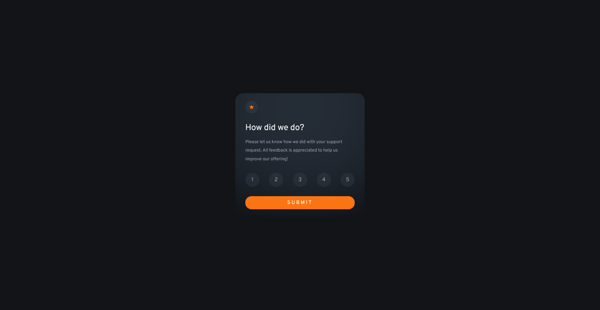

# Interactive Rating

This project was generated with [Angular CLI](https://github.com/angular/angular-cli) version 15.0.4.

## Table of contents

- [Overview](#overview)
  - [The challenge](#the-challenge)
  - [Screenshot](#screenshot)
  - [Links](#links)
- [My process](#my-process)
  - [Built with](#built-with)
  - [Useful resources](#useful-resources)
- [Author](#author)

# Frontend Mentor - Interactive rating component solution

This is a solution to the [Interactive rating component challenge on Frontend Mentor](https://www.frontendmentor.io/challenges/interactive-rating-component-koxpeBUmI). Frontend Mentor challenges help you improve your coding skills by building realistic projects. 

### The challenge

Users should be able to:

- View the optimal layout for the app depending on their device's screen size
- See hover states for all interactive elements on the page
- Select and submit a number rating
- See the "Thank you" card state after submitting a rating

### Screenshot

### Links

- Solution URL: [Click here to see it](https://your-solution-url.com)
- Live Site URL: [Click here to see it](https://your-live-site-url.com)

## My process

### Built with

- AngularJS v15.2.8

### Useful resources

- [Angular Documentation](https://docs.angular.lat/) - This helped me to overview how to use the resources that Angular offers me.

## Author

- Website - [My portfolio](https://said.digysoft.com)
- Frontend Mentor - [@SaidSuyv](https://www.frontendmentor.io/profile/SaidSuyv)
- Github - [@SaidSuyv](https://github.com/SaidSuyv)